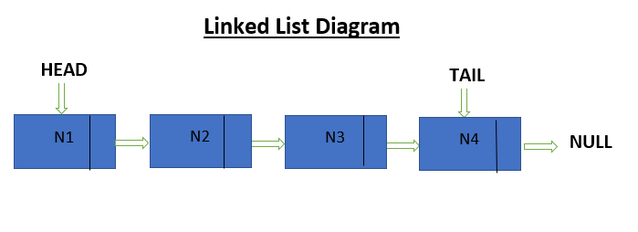

# LinkedList-Implementation
LinkedList is a data structure that stores elements in a non-contiguous location.
Each data item is called a ‘Node’ and each node has a data part and an address part. The address part stores the link to the next node in the LinkedList.

### OverView
The above example creates a custom linkedlist with functionalities like insert, remove and print. The above program stores the list of user entered songs in the linked list and also stores the songs and their respective artists in a hashmap. The user can modify the name of artist or can delete the song from the list.

## LinkedList Diagram

